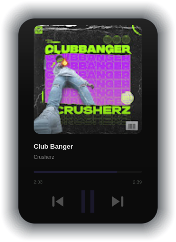

[](https://www.python.org/)
[](https://www.kernel.org/)
[](https://archlinux.org/)
[](https://www.debian.org/)
[](https://getfedora.org/)
[](https://www.gentoo.org/)
[](https://www.opensuse.org/)

---
# 🎵 Aurora Music Widget

A beautiful floating music widget for Linux — frameless, always-on-top, with dynamic colors extracted from album art. Inspired by macOS widgets, Rainmeter, Hyprland rice setups, and the Spotify aesthetic.    




Works in theory.

---

## ✨ Features

| Feature | Details |
|---|---|
| **Floating window** | Draggable, always-on-top, frameless |
| **Translucent UI** | Acrylic-style blur with rounded corners |
| **Album artwork** | Circular display with animated progress ring |
| **Dynamic colors** | Full palette extracted live from each album cover |
| **Smooth animations** | 60 fps exponential smoothing on all transitions |
| **Media controls** | Play/Pause, Next, Previous |
| **Progress bar** | Seekable, hover-to-expand |
| **Live timestamps** | Current position + total duration |
| **Auto-scrolling labels** | Long track/artist names scroll smoothly |
| **Compact mode** | Double-click to toggle minimal view |
| **Keyboard shortcuts** | Space, ←/→, C, Esc |

---

## 🎧 Player Support

Works with **any MPRIS2-compatible player**:

- **Spotify** (Linux client)
- **VLC**
- **Chromium / Google Chrome** (with media controls)
- **Firefox** (with media tab)
- **YouTube Music** (in-browser or Electron wrapper)
- **Rhythmbox**, **Clementine**, **Strawberry**, **Cantata**
- **mpd** (via `mpd-mpris`)
- **cmus** (via `cmus-remote`)
- Any other MPRIS2 player

The widget automatically discovers all active players via DBus and prioritizes the most recently active one.

---

## 🐧 System Requirements

| Component | Requirement |
|---|---|
| Python | 3.8+ |
| Qt | PyQt6 (Qt 6.x) |
| DBus | dbus-python |
| Image processing | Pillow + colorthief |
| Display | X11 or Wayland (via XWayland) |

---

## 📦 Installation

### Quick install (Debian/Ubuntu/Mint)
```bash
sudo apt install python3-pip python3-dbus
pip3 install PyQt6 Pillow colorthief --user
python3 musicwidget.py
```

### Arch / Manjaro
```bash
sudo pacman -S python-pyqt6 python-dbus python-pillow
pip3 install colorthief --user
python3 musicwidget.py
```

### Gentoo
```bash
emerge dev-python/dbus-python dev-python/pillow
pip3 install PyQt6 colorthief --break-system-packages
python3 musicwidget.py
```

### Fedora
```bash
sudo dnf install python3-PyQt6 python3-dbus
pip3 install Pillow colorthief --user
python3 musicwidget.py
```

### All-in-one installer
```bash
chmod +x install.sh && ./install.sh
aurora-widget  # after install
```

---

## ⌨️ Keyboard Shortcuts

| Key | Action |
|---|---|
| `Space` | Play / Pause |
| `←` | Previous track |
| `→` | Next track |
| `C` | Toggle compact mode |
| `Esc` | Quit |

---

## 🎨 Design

- **Background**: Deep translucent panel, hue-tinted from album art
- **Accent color**: Dominant + saturated color from artwork
- **Typography**: System fonts with smooth scroll for long names
- **Progress ring**: Surrounds album art, pulses while playing
- **Play button**: Filled circle with glow effect
- **All transitions**: Smooth exponential interpolation (no jarring snaps)

---

## 🖥️ Wayland Notes

The widget uses `Qt::X11BypassWindowManagerHint` for always-on-top support. On Wayland, it runs under XWayland automatically. For native Wayland support with window layering, consider using a compositor-specific shell (e.g. `wlr-layer-shell` via `qtlayershell`).

---

## 🔧 Architecture

```
musicwidget.py
├── MPRISWorker (QThread)     — DBus polling, artwork fetching
├── MusicWidget (QWidget)     — main frameless window, drag, paint
│   ├── ArtworkWidget         — circular art + progress ring
│   ├── ScrollLabel           — auto-scrolling text
│   ├── CtrlBtn               — animated icon buttons
│   └── ProgressBar           — seekable progress bar
├── AnimFloat / AnimColor     — smooth 60fps interpolators
└── palette_from_image()      — ColourThief → full theme palette
```

---

## 📄 License

MIT — free to use, fork, and rice.
